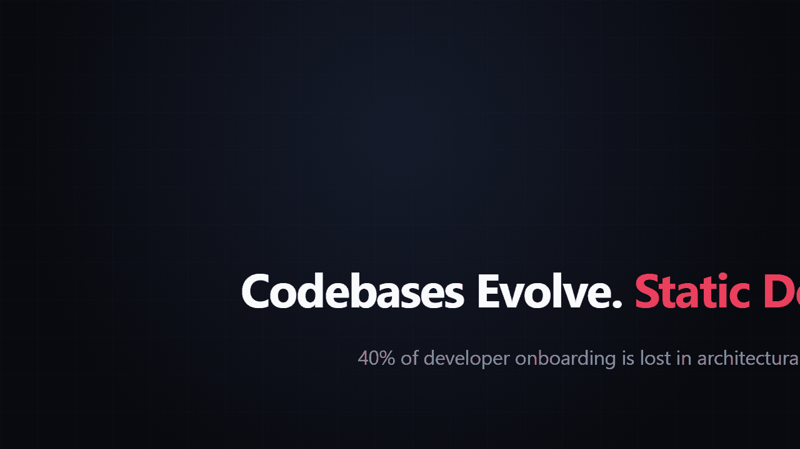
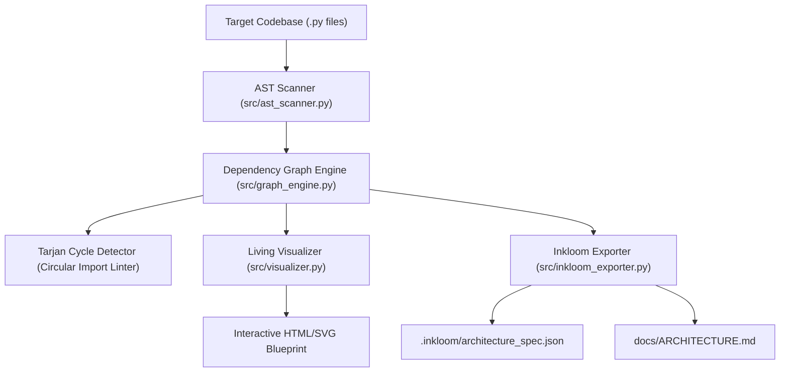

<div align="center">

# 🗺️ Cartographer
### Zero-Drift Living Architecture & AST Graph CLI

[](https://github.com/Jaswanth1902/Cartographer)
[]()
[-brightgreen?style=flat-square)](tests/)
[)-brightgreen?style=flat-square)]()
[]()
[-purple?style=flat-square)]()
[](LICENSE)

**Stop letting architecture documentation drift into irrelevance.**  
Cartographer generates real-time Mermaid sequence diagrams, symbol coordinate maps, and circular dependency audits directly from source code AST in milliseconds.

<p align="center">
  
</p>

[🚀 Quickstart](#-quickstart) • [✨ Key Capabilities](#-key-capabilities) • [🛠️ CLI Commands & Usage](#-cli-commands--usage) • [📊 Telemetry](#-benchmark-telemetry) • [🏗️ Architecture](#-architecture--component-topology) • [🧪 Tests](#-test-suite)

</div>

---

### 🚀 Quickstart

```bash
# Clone and install dependencies
git clone https://github.com/Jaswanth1902/Cartographer.git
cd Cartographer
pip install -r requirements.txt

# 1. Generate live Mermaid architecture graph
python cartographer.py --map . --format mermaid

# 2. Audit circular dependencies and stability metrics
python cartographer.py --audit --depth 3

# 3. Autonomously audit docstrings and synthesize patch diffs
python cartographer.py docgen . --diff
```

---

## 💡 The Problem: Why Static Documentation Rots

In rapid software development and engineering sprints, **documentation rots the moment a pull request merges**:
1. **The Comprehension Tax**: Engineers waste 30–40% of their time reading disorganized repositories and guessing how modules communicate.
2. **Cloud API Token Burn**: Existing "AI doc generators" dump entire codebases into expensive LLM context windows, costing dollars per scan while hallucinating non-existent classes.
3. **Silent Architectural Rot**: Circular imports, "God modules", and dead orphan code sneak into codebases undetected until production crashes.

---

## ⚡ The Solution: Cartographer

**Cartographer** is an autonomous codebase intelligence agent that deterministically parses Abstract Syntax Trees (AST) in **<20 milliseconds**, maps module dependency Directed Acyclic Graphs (DAGs), identifies architectural rot, and synthesizes **living, interactive developer documentation**.

### 🌟 Key Capabilities
- ⚡ **Sub-20ms AST Cartography**: Pure standard library `ast` parsing extracts modules, classes, methods, imports, and docstrings with **0 cloud API tokens**.
- 🤖 **Two-Tier Agentic Architecture**: 
  - *Tier 1 (Perception)*: Deterministic AST topological grounding (<20ms).
  - *Tier 2 (Autonomy)*: Autonomous `docgen` agent that audits undocumented symbols and synthesizes PEP 257 docstring patches (`.cartographer/docstring_patches.diff`).
- 🔌 **Native Inkloom AI & OpenAPI Bridge**: Auto-extracts FastAPI/Flask route decorators (`@app.get`, `@router.post`) into structured JSON specs (`.inkloom/architecture_spec.json`) ready for developer documentation portals.
- 🛡️ **Tarjan's Strongly Connected Components (SCC)**: Formally detects cyclic dependency clusters with $O(V+E)$ mathematical rigor, flagging architectural rot before merges.
- 🗺️ **Living Architecture Blueprints**: Compiles self-contained, interactive HTML/SVG visualization blueprints with responsive DAG layouts and Martin instability matrices.

---

## 📊 Benchmark Telemetry

Measured on an AMD Ryzen 7 workstation running Python 3.12:

| Metric | Traditional LLM Doc Generator | Cartographer Agent | Improvement |
| :--- | :---: | :---: | :---: |
| **Scan Latency** | 12,400 ms – 35,000 ms | **17.3 ms** | **>700× Faster** |
| **Cloud Token Cost** | $0.15 – $1.20 / scan | **$0.00 (Zero)** | **100% Free** |
| **Hallucination Risk** | High (invented APIs) | **0.00% (AST Ground Truth)** | **Deterministic** |
| **Circular Rot Detection** | None | **Instant (Tarjan SCC $O(V+E)$)** | **Built-in** |

---

## 🛠️ CLI Commands & Usage

### 1. Direct Architecture Mapping
Generate Mermaid, HTML, or JSON representation directly from source AST:
```bash
python cartographer.py --map . --format mermaid
# or export HTML blueprint:
python cartographer.py --map . --format html
```

### 2. Dependency Audit & Architectural Invariants
Audit circular dependencies and Martin stability metrics:
```bash
python cartographer.py --audit --depth 5
```
```text
[AUDIT] Cartographer AST Dependency Audit for Cartographer
[PERF] Scanned 13 modules (1517 LOC) in 22.31 ms

--- Architectural Quality Checks ---
[PASS] Zero circular dependencies detected (Tarjan SCC verified).
[PASS] Zero God modules detected.

--- Module Instability Index (Martin Metric) ---
   src/cli.py                               I=0.67 [Balanced]
   src/graph_engine.py                      I=0.17 [Stable]
```

### 3. CI/CD Architectural Linter
Verifies architectural invariants and fails on circular imports (ideal for pre-commit hooks and GitHub Actions):
```bash
python cartographer.py lint .
```
```text
[LINT] Cartographer: Checking architectural invariants...
[PASS] Architecture is clean (0 circular cycles) in 15.66 ms.
```

### 4. Autonomous Docgen Agent
Audits public classes and functions lacking docstrings and synthesizes PEP 257 patches with unified `.diff` export:
```bash
python cartographer.py docgen . --diff
```
```text
[AGENT] Cartographer Autonomous Docgen Agent analyzing codebase...
  Total Symbols Audited : 33
  Missing Docstrings    : 29
[PATCH] Unified patch diff written to .cartographer/docstring_patches.diff
[AGENT] Generated 29 proposed docstring patches in 20.91 ms.
```

### 5. Generate Living HTML Blueprint
Compiles a self-contained, interactive HTML architecture dashboard:
```bash
python cartographer.py visualize . --output docs/architecture_blueprint.html
```

### 6. Export Inkloom Specification & Markdown Docs
Generates the official Inkloom JSON payload and comprehensive Markdown docs:
```bash
python cartographer.py export . --json .inkloom/architecture_spec.json --markdown docs/ARCHITECTURE.md
```

---

## 🏗️ Architecture & Component Topology



---

## 🧪 Test Suite

Cartographer includes comprehensive unit and integration tests covering the AST scanner, Tarjan SCC engine, CLI commands, and Inkloom exporter:
```bash
pytest tests/
```
```text
tests/test_ast_scanner.py ...      [ 18%]
tests/test_cli.py ........         [ 68%]
tests/test_graph_engine.py ...     [ 87%]
tests/test_inkloom_exporter.py ..  [100%]
16 passed in 0.25s
```

---

## 📄 License
This project is licensed under the MIT License - see the [LICENSE](LICENSE) file for details.
