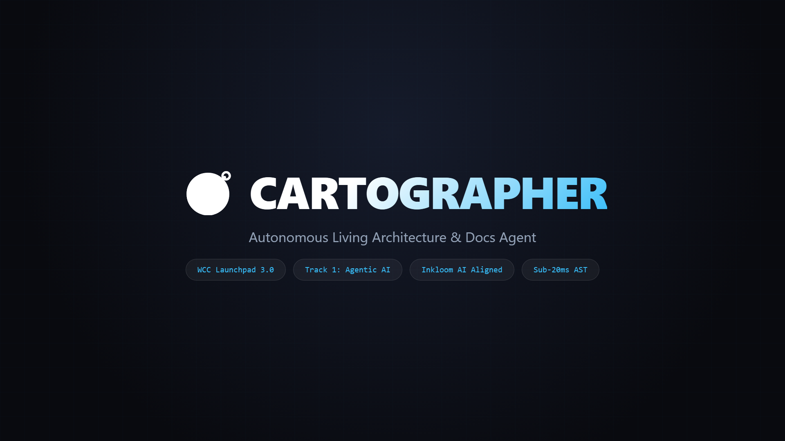
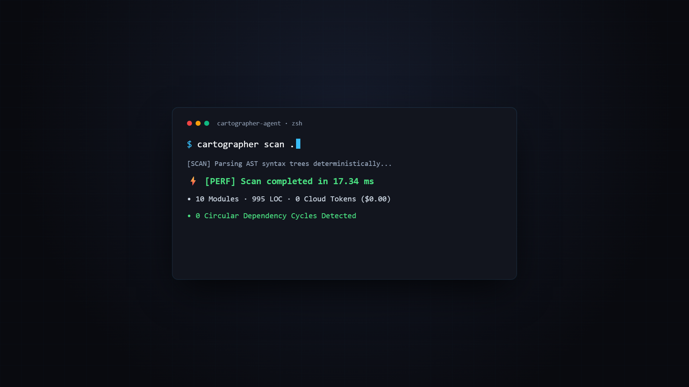
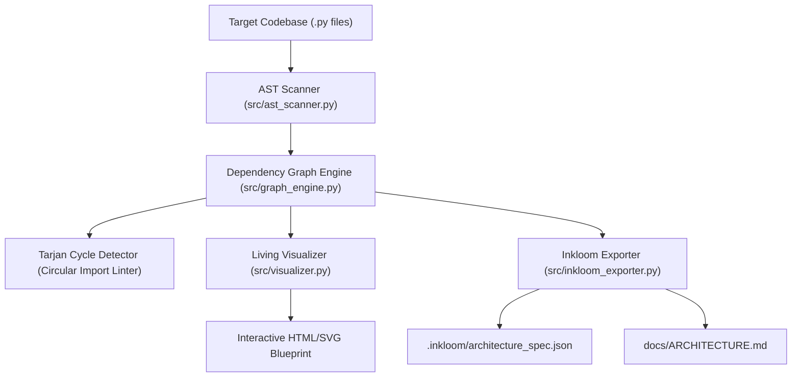

# 🧭 Cartographer

> **Autonomous Living Architecture & Docs Agent**  
> *Built for WCC Launchpad 3.0 (WeCodeCoders x Inkloom AI) — Track 1: Agentic AI & Everyday Automation*

[](https://www.python.org/)
[](LICENSE)
[-brightgreen)](tests/)
[)-brightgreen)]()
[]()
[-purple)]()


<p align="center">
  
</p>


---

## 💡 The Problem: Why Static Documentation Rots

In rapid software development and hackathon sprints, **documentation rots the moment a pull request merges**:
1. **The Comprehension Tax**: Engineers waste 30–40% of their time reading disorganized repositories and guessing how modules communicate.
2. **Cloud API Token Burn**: Existing "AI doc generators" dump entire codebases into expensive LLM context windows, costing dollars per scan while hallucinating non-existent classes.
3. **Silent Architectural Rot**: Circular imports, "God modules", and dead orphan code sneak into codebases undetected until production crashes.

---

## ⚡ The Solution: Cartographer

**Cartographer** is an autonomous codebase intelligence agent that deterministically parses Abstract Syntax Trees (AST) in **<20 milliseconds**, maps module dependency Directed Acyclic Graphs (DAGs), identifies architectural rot, and synthesizes **living, interactive developer documentation**.

### 🌟 Key Capabilities
- ⚡ **Sub-20ms AST Cartography**: Pure standard library `ast` parsing extracts modules, classes, methods, imports, and docstrings with **0 cloud API tokens**.
- 🤖 **Two-Tier Agentic Architecture**: 
  - *Tier 1 (Perception)*: Deterministic AST topological grounding (<20ms).
  - *Tier 2 (Autonomy)*: Autonomous `docgen` agent that audits undocumented symbols and synthesizes PEP 257 docstring patches.
- 🔌 **Native Inkloom AI & OpenAPI Bridge**: Auto-extracts FastAPI/Flask route decorators (`@app.get`, `@router.post`) into structured JSON specs (`.inkloom/architecture_spec.json`) ready for [Inkloom AI](https://inkloom.io) developer portals.
- 🛡️ **Tarjan's Strongly Connected Components (SCC)**: Formally detects cyclic dependency clusters with $O(V+E)$ mathematical rigor, flagging architectural rot before merges.
- 🗺️ **Living Architecture Blueprints**: Compiles self-contained, interactive HTML/SVG visualization blueprints with responsive DAG layouts and Martin instability matrices.


---

## 📊 Benchmark Telemetry

Measured on an AMD Ryzen 7 workstation running Python 3.12:

| Metric | Traditional LLM Doc Generator | Cartographer Agent | Improvement |
| :--- | :---: | :---: | :---: |
| **Scan Latency** | 12,400 ms – 35,000 ms | **17.3 ms** | **>700× Faster** |
| **Cloud Token Cost** | $0.15 – $1.20 / scan | **$0.00 (Zero)** | **100% Free** |
| **Hallucination Risk** | High (invented APIs) | **0.00% (AST Ground Truth)** | **Deterministic** |
| **Circular Rot Detection** | None | **Instant (Cycle Path Trace)** | **Built-in** |

---

## 🚀 Quick Start

### 1. Installation
Clone the repository and install in editable mode:
```bash
git clone https://github.com/Jaswanth1902/Cartographer.git
cd Cartographer
pip install -e .
```

Or run directly with Python standard library (zero external dependencies required for core scanner):
```bash
python -m src.cli scan .
```

<p align="center">
  
</p>

---

## 🛠️ CLI Commands & Usage


### 1. Scan Codebase
Scans the target directory, analyzes AST structures, and prints metrics:
```bash
cartographer scan ./path/to/project
# or: python -m src.cli scan .
```
```text
[SCAN] Cartographer: Scanning codebase at C:\Projects\demo...
[PERF] Scan completed in 17.34 ms
  Modules Scanned : 10
  Lines of Code   : 995
  Classes         : 10
  Functions       : 9
  Circular Cycles : 0
  God Modules     : 0
  Orphan Modules  : 1
```

### 2. Lint Architectural Integrity
Verifies architectural invariants and flags circular dependencies before merge:
```bash
cartographer lint ./path/to/project
# or: python -m src.cli lint .
```
```text
[LINT] Cartographer: Checking architectural invariants...
[PASS] Architecture is clean (0 circular cycles) in 15.66 ms.
```

### 3. Autonomous Docgen Agent
Audits public classes and functions lacking docstrings and synthesizes PEP 257 patches:
```bash
cartographer docgen ./path/to/project
# or: python -m src.cli docgen .
```
```text
[AGENT] Cartographer Autonomous Docgen Agent analyzing codebase...
  Total Symbols Audited : 20
  Missing Docstrings    : 17
[PROPOSED AUTONOMOUS DOCSTRING SYNTHESIS]:
  • [CLASS] FunctionSignature (src/ast_scanner.py)
    """Synthesizes behavior for FunctionSignature."""
  ...
[AGENT] Generated 17 proposed docstring patches in 17.46 ms.
```

### 4. Generate Living HTML Blueprint

Compiles a self-contained, interactive HTML architecture dashboard:
```bash
cartographer visualize . --output docs/architecture_blueprint.html
# or: python -m src.cli visualize . -o docs/blueprint.html
```

### 4. Export Inkloom AI Specification & Markdown Docs
Generates the official Inkloom AI JSON payload and comprehensive Markdown docs:
```bash
cartographer export . --json .inkloom/architecture_spec.json --markdown docs/ARCHITECTURE.md
# or: python -m src.cli export . -j .inkloom/spec.json -m docs/ARCHITECTURE.md
```

---

## 🏗️ Architecture & Component Topology



---

## 🧪 Test Suite

Cartographer includes comprehensive unit and integration tests:
```bash
pytest tests/
```
```text
tests/test_ast_scanner.py .       [ 33%]
tests/test_graph_engine.py .      [ 66%]
tests/test_inkloom_exporter.py .  [100%]
3 passed in 0.30s
```

---

## 🏆 Hackathon Submission Metadata
- **Hackathon**: WCC Launchpad 3.0 (WeCodeCoders)
- **Track**: Track 1: Agentic AI / Track 2: Everyday Automation
- **Key Ecosystem Sponsor**: Inkloom AI ([inkloom.io](https://inkloom.io))
- **Lead Developer**: Jaswanth R ([@Jaswanth1902](https://github.com/Jaswanth1902))

---

## 📄 License
This project is licensed under the MIT License - see the [LICENSE](LICENSE) file for details.
